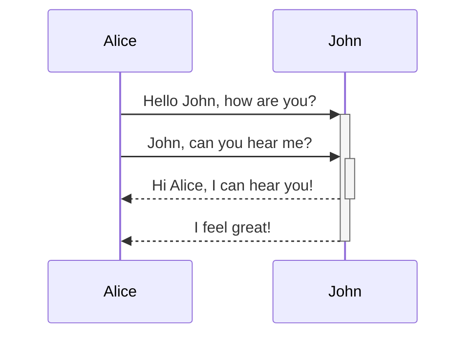

# Mermaid Diagrams

This is a brief walkthrough on how to create [mermaid diagrams]() with Obsidian using Markdown.

Obsidian uses [Mermaid](https://mermaid-js.github.io/) to render diagrams and charts. Mermaid also provides [a helpful live editor](https://mermaid-js.github.io/mermaid-live-editor).

<pre><code>```mermaid
sequenceDiagram
    Alice->>+John: Hello John, how are you?
    Alice->>+John: John, can you hear me?
    John-->>-Alice: Hi Alice, I can hear you!
    John-->>-Alice: I feel great!
```</code></pre>



***
Links: 
Source:

